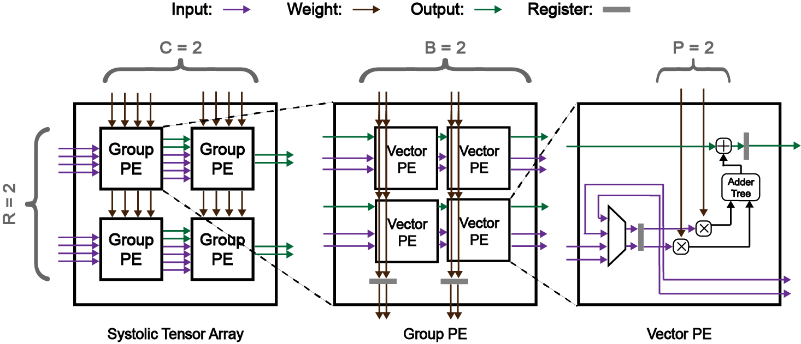
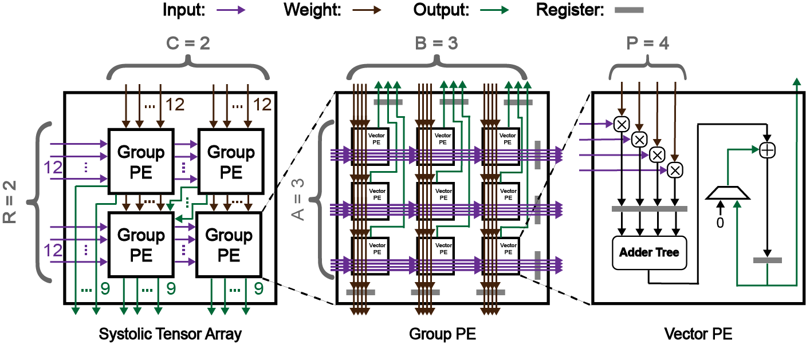

STAG: Systolic Tensor Array Generator
=======================

The systolic tensor arrays is a generale and parallelized version of the systolic arrays.  
STAG automatically generate systolic tensor array RTL in various forms.  

Currently, STAG propose 2 types of systolic arrays with 3 dataflows input stationary, output stationary and weight stationary.  
1. Systolic tensor array  
2. Dimension-Aligned Systolic Tensor Array = skew buffer + systolic tensor array + de-skew buffer  

We are going to provide control logic and automatic RTL test soon.  

## 5 essential systolic tensor array parameters 
R: The row of group PE
C: The column of group PE  
A: The row of vector PE  
B: The column of vector PE  
P: The total number of multipliers in vector PE  
Based on these 5 parameters, we can easily generate the systolic tensor array RTL.  

## How to run
Download [Chisel](https://github.com/chipsalliance/chisel) and run the makefile.
Configuration files is located in src/main/resources/

## Proposed systolic tensor array architecture image
### Input stationary systolic tensor array

### Output stationary systolic tensor array

### Weight stationary systolic tensor array

## Proposed dimension aligned tensor array architecture image
### Dimension aligned input stationary systolic tensor array

### Dimension aligned output stationary systolic tensor array

### Dimension aligned weight stationary systolic tensor array
